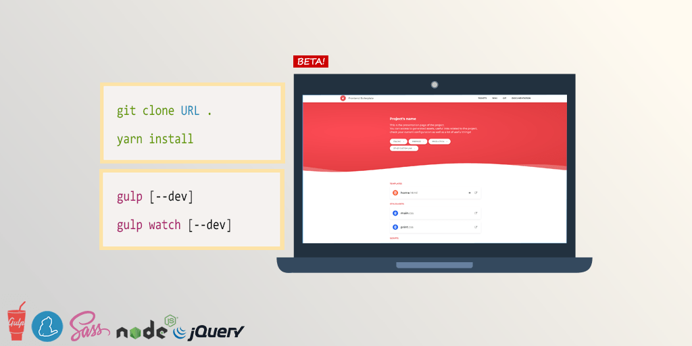

# Frontend Boilerplate

Minimalist and ready to use frontEnd HTML5/CSS/JS Boilerplate for creating new web projects with [Gulp.js](https://gulpjs.com/).

# Getting Started

These instructions will help you run the project on a live system or on your local machine for 
development and testing purposes.

## Dependencies

First, make sure these are installed on your machine :

- [Node.js](http://nodejs.org)
- [Yarn](https://yarnpkg.com/)
- [Gulp](http://gulpjs.com)

## Quick start

In bash/terminal/command line, `cd` into your project directory.

1. Clone this repo or download zip.
2. Run `yarn install` to install required files. (Add --no-bin-links if on VirtualBox.)
3. When it's done installing, run one of the task runners to get going :
	- `gulp [--dev]` manually compiles HTML/CSS/JS files.
	- `gulp watch [--dev] [--reload]` automatically compiles HTML/CSS/JS and spies on files changes.
	
Consider using the `--dev` option for development and testing purposes **only**.

If you have any issue with `yarn install` on Windows, run the CLI as administrator and execute the following command :
`npm install -g --production windows-build-tools && npm rebuild`. Then close & open the CLI and try again.

:+1: :rocket: :+1: :rocket: :+1: :rocket: :+1: :rocket: :+1: :rocket: :+1: :rocket: :+1:

# Configuration

Everything you need is in *gulp-includes/gulp-configuration.js*.

# Documentation

- [Available Gulp commands](./gulp-commands.md)
- [Use external libraries with Yarn](./external-libraries.md)
- [SCSS custom functions, mixins, image dimensions, inline assets](./scss-functions.md)
- [SCSS lint - How to bypass gulp check-scss warnings](./scss-lint.md)
- [JSHint - How to bypass gulp check-js warnings](./jshint.md)
- [Modernizr features detection](./modernizr.md)
- [Plugin: Built-in JavaScript viewport informations (gulp_display)](./viewport-framework.md)
- [Plugin: Responsive/Retina/Lazyload image](./responsive-image-plugin.md)
- [Plugin: Lazyload Iframe](./lazyload-iframe.md)
- [Plugin: Detect New Html Elements](./detect-new-html-elements.md)
- [CMS/Framework Integration](./cms-framework.md)

# Maintenance

Update outdated NPM dependencies :

`yarn upgrade-interactive --latest` (Add --no-bin-links if on VirtualBox.)

# Authors

  

# License

Copyright (c) [Fidesio](https://www.fidesio.com/) and Contributors. All Rights Reserved.
